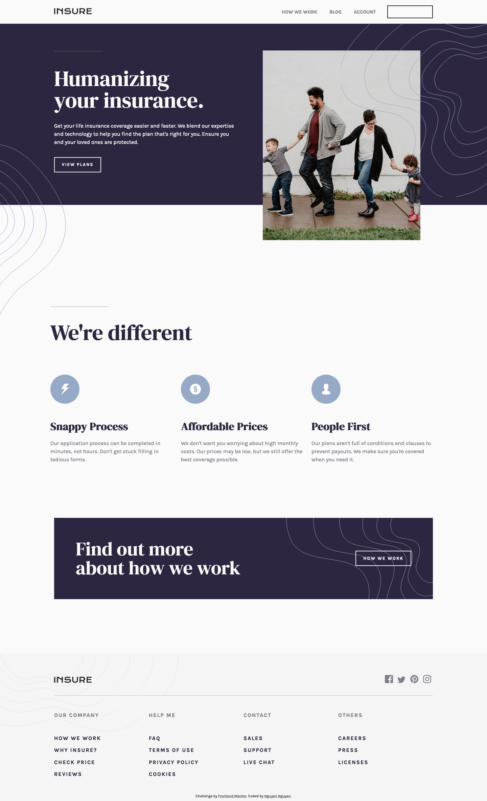

# Frontend Mentor - Insure landing page solution

This is a solution to the [Insure landing page challenge on Frontend Mentor](https://www.frontendmentor.io/challenges/insure-landing-page-uTU68JV8). Frontend Mentor challenges help you improve your coding skills by building realistic projects.

## Table of contents

- [Overview](#overview)
  - [The challenge](#the-challenge)
  - [Screenshot](#screenshot)
  - [Links](#links)
- [My process](#my-process)
  - [Built with](#built-with)
  - [What I learned](#what-i-learned)
  - [Continued development](#continued-development)
  - [Useful resources](#useful-resources)
- [Author](#author)
- [Acknowledgments](#acknowledgments)

## Overview

### The challenge

Users should be able to:

- View the optimal layout for the site depending on their device's screen size
- See hover states for all interactive elements on the page

### Screenshot



### Links

- Solution URL: [View codes](https://github.com/jesuisbienbien/insure-landing-page)
- Live Site URL: [View Live Site](https://jesuisbienbien.github.io/insure-landing-page/)

## My process

### Built with

- Semantic HTML5 markup
- Flexbox
- CSS Grid
- Mobile-first workflow
- Vanilla Javascript

### What I learned

```css
*complex css selector: when the nav--item is hovered, nav--link text should change color*
.nav--item:last-of-type {
  border: 2px solid var(--very-light-gray);
  padding: 1rem 0 1rem;
  &:hover {
    background-color: var(--very-light-gray);
  }
}
.nav--item:last-of-type:hover .nav--link:last-of-type {
  color: var(--very-dark-violet);
}
```

### Continued development

### Useful resources

## Author

- Github - [Nguyen Nguyen](https://github.com/jesuisbienbien)
- Frontend Mentor - [@jesuisbienbien](https://www.frontendmentor.io/profile/jesuisbienbien)

## Acknowledgments
